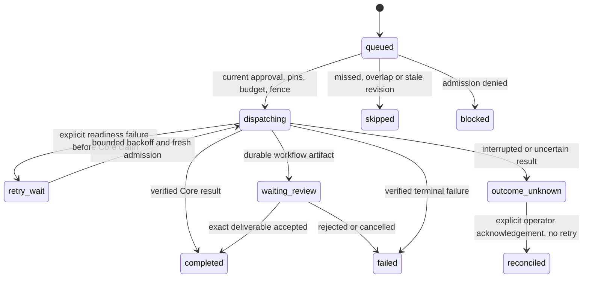

# Core automation and capability contracts

Automation decisions belong to the existing Core OS/advisory owner. A lifespan task wakes that owner every 15 seconds; UTC clock, durable cursor, current human authority and signed configuration determine eligibility. Browser timers and Hermes jobs have no authority. Startup recovery never takes ownership from an active owner. Local execution stops with the process/device; Hosted availability is not an SLA. Sequential dispatch can delay later schedules behind a slow permitted run.

## Scope, pins and approval

`packages/contracts/automation.py` rejects unknown fields, caller identity, host actions, arbitrary commands and naive timestamps. Definitions bind organization, project, immutable human owner, revision, exact target/version/hash/activation, input, explicit model consent, schedule and policy. Creation/edit requires current organization admin authority, stores paused state and issues a new configuration hash. Exact Core human approval precedes resume or manual delivery. Pause/resume changes control state without revising the reviewed configuration. Editing invalidates prior approval. Another owner cannot edit/approve/dispatch using the original owner's authority.

Agent targets require a published known-good version, authenticated active assignment/transition and empty tool grants. Workflow targets require an immutable validated graph/digest and its governed pinned assignments; they have no assignment activation ID. Target discovery is scoped and bounded, with unavailable reasons. Core rechecks exact agent activation at claim commit. Workflow tasks use the graph's existing version pins and Core admission rules. No target endpoint confers execution authority.

Read APIs are under `/api/projects/{project_id}`: `/automations`, `/automations/{id}`, `/{id}/occurrences`, `/{id}/events`, `/automation-targets`, `/automation-preview`, `/capabilities`. Mutations are POST create/edit, `/{id}/approve`, `/{id}/state`, `/{id}/run`, and `/{id}/occurrences/{occurrence_id}/reconcile`. There is no HTTP tick, clock override, worker takeover, secret/grant mutation or native job endpoint. Existing same-origin session/CSRF, current membership and scope checks apply. Lists default to 25, maximum 100, reject unknown/duplicate query keys, and resolve continuation references inside the current project; continuations are not bearer authority.

## Recurrence, bounded recovery and budgets

Interval recurrence advances from an aware UTC anchor; the timezone is a presentation setting for intervals. Daily/weekly recurrence uses IANA local wall time. Nonexistent DST times are skipped; ambiguous times use fold 0 once. Preview returns five actual UTC and local offset instants from the server clock. Windows installs first-party `tzdata` through the application lockfile.

The next cursor is strictly after creation/edit time and is retained across pause/resume. A due instant more than 60 seconds behind the clock is missed. `skip` records bounded missed skips; `catch_up` keeps the latest 1–3 instants within seven days. Older instants are recorded as a coalesced interval with no invented count or fabricated individual history. Backward clock movement does not rewind the cursor. Each tick plans at most 20 definitions and dispatches at most 20 eligible occurrences. Recovery examines at most 100 active occurrences; large unknown backlogs need operator reconciliation and are not a distributed scalability claim.

`skip` overlap suppresses a new occurrence while another is dispatching, waiting review or unknown. `queue` retains at most three ready scheduled occurrences per definition and records excess as skipped. Ready selection excludes schedules held by a busy occurrence so those queues do not consume other schedules' dispatch slots. Manual override is explicit and bound to a caller intent key; repeated keys return the same occurrence and never redispatch, including after a lost response. A key from another configuration revision cannot start new work.

Daily maximum counts committed admissions at their actual UTC admission day, including previously queued work. Core's existing per-run/global reservations remain authoritative. Automation task limits can only reduce the captured Core limit. Actual usage comes from Core settlement; this does not establish a hard provider monetary/token guarantee.

## Durable state and effect boundary

Definition/occurrence claims serialize on the definition row and unique `(automation_id, occurrence_key)`. Interactive management and planner transactions lock current human membership before the definition. Target preflight completes its resource-before-membership transaction before scheduling locks. The eventual Core agent/workflow claim callback rechecks current schedule state/revision/hash/approval/fence/budget and binds the actual Run ID plus admission timestamp in the same transaction as admission, before runtime effects. No database transaction spans an await.

Only explicit runtime readiness errors before any committed Core Run may retry, with maximum 1–3 attempts and bounded exponential backoff. Runtime admission, missing usage, lost reply, process death or unknown effects after a Core claim never automatically retry. Restart marks interrupted unclaimed deliveries unknown and refreshes committed Run/workflow state. Unknown retains overlap hold. An administrator may acknowledge the unknown and release that hold with an auditable reason and explicit no-retry acknowledgement; this does not settle Core's unknown run/reservation or prove absence of an external effect.

## Storage and compatibility

Migration `020_core_automations` follows `019_intelligence_recovery` after 018/017/016/015. It adds empty definitions, occurrences and events with scope/parent/status/due/admission indexes, foreign keys and occurrence uniqueness. No historical approval, entitlement or evidence is backfilled. Definition and occurrence updates require signatures/protected heads; deletion/replacement is denied. Events are immutable. PostgreSQL restricted writers cannot disable guards, truncate history or create schema. All three counts are checked before downgrade; populated downgrade refuses before dropping anything. Empty downgrade/upgrade and legacy history preservation remain covered by the full migration regressions. Back up and restore governed data rather than attempting a populated downgrade.

## Capability registry and threat review

`modules/core/capabilities.py` is a read model, with namespace version, actual adapter, supported mode, risk, current Core permission, empty grants, requirements and missing prerequisites. Supported classes are scoped artifact reads, governed text agents/workflows/schedules and the existing project-owned disposable Relay fixture. Exact target readiness and approval remain per-action checks. Local/Hosted mode comes from server configuration; unavailable plan/entitlement remains unknown. BYOK/local tokens are not reported as Managed AI money.

| Threat | Enforced boundary / observed tests |
|---|---|
| Forged owner, target, activation, tool or native job | Strict input, exact claim pins, empty grants, unchanged nine-route wrapper; automation and existing Hermes security tests |
| Revoked actor/approver after preview | Membership and approval revalidated in the claim transaction; no runtime call on denial |
| Concurrent or repeated delivery | Parent lock, immutable intent key, Core callback before effects; SQLite and live PostgreSQL contention tests |
| Record/signature/approval tamper | Signed payload, indexed-column equality and independent protected heads; malformed payload fails closed |
| Crash, lost reply, missing usage | Durable admission, unknown result and no automatic effect retry; before/after-claim restart tests |
| Previous-day queue bypasses quota | Actual admission timestamp counted again at commit; SQLite/PostgreSQL regression |
| Unknown effect falsely called resolved | Reconciliation only acknowledges the scheduling hold; Core run/reservation remains unknown |
| Registry expands host authority | Read-only API; host file/browser/network/code, Hermes admin/native jobs and commercial actions default denied |
| Runtime or host compromise | Existing confined adapter and protected history boundaries; no claim of a general host sandbox or immunity to source/signing-key compromise |

Actual tests, platform skips, screenshots, source SHA, CI and residual deployment work are in [Studio validation](studio-redesign-validation.md).
