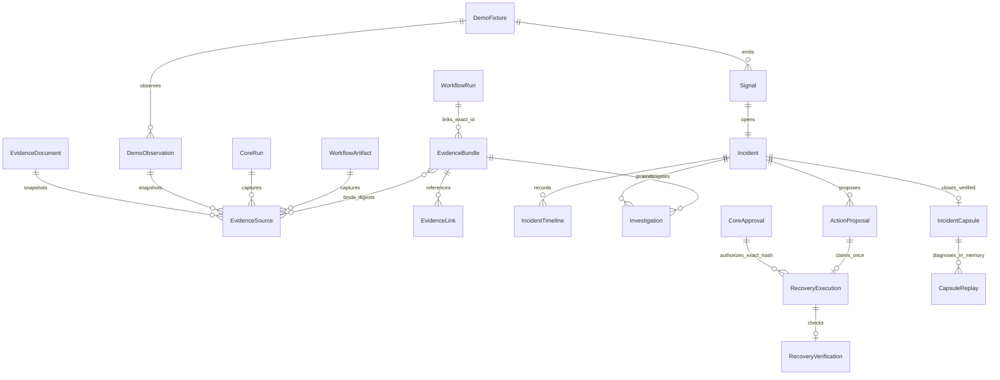
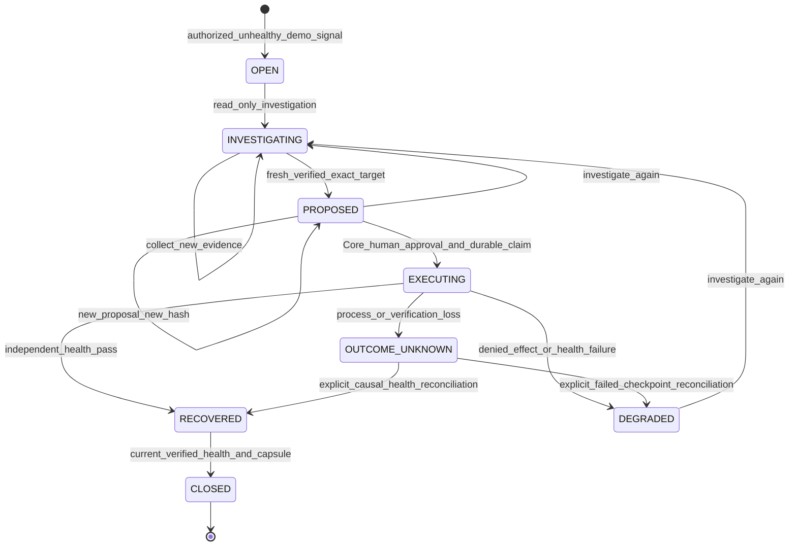

# Evidence and disposable recovery contracts

Scope: supplied Studio PRD v1.2 §12–13 and Prompt 04, BR-01–07 / RL-01–08 / BN-05–07. Core remains the existing authority. The identifiers refer to the supplied PRD; absent normative PDFs have not been reviewed. No new identity, approval, execution owner, signer or promotion authority is introduced.

## Records and provenance

`packages/contracts/intelligence.py` rejects unknown fields, caller actor identity, arbitrary actions, commands, URLs, host paths and caller-supplied hashes. Every stored record binds organization/project, timestamp, indexed relationships, canonical JSON signature and the existing independent protected history head. Database rows are insufficient without their Core signatures and protected commitments. Append-only SQL guards protect immutable records; mutable fixture/incident/execution checkpoints cannot be erased or replaced. Every API read authorizes the current scope, and every mutation rechecks membership inside its transaction.

Sources are bounded 64 KiB database snapshots. Internal artifact adapters use the existing authorized manifest/blob/digest/lineage verification and extract plaintext from the allowlisted inert document. Core Run adapters verify actual captured execution claims and report actual output/status/version/model provenance. Historical disposable observations are signed measurements of a real project-owned database fixture at a particular revision. User documents are explicitly scoped demo input, sanitized and digest-bound; their provenance proves the stored document, not external factual truth. No web/document connector is silently simulated. External connectors remain unavailable.

Source retrieval rechecks the origin and snapshot digest/length/MIME, reconstructs sanitized content, and reports quality, observed_at, collected_at and maximum age (up to seven days). `UNVERIFIED` sources have no claim-bearing excerpt. Freshness is calculated on each read; future-dated or stale evidence cannot supply required coverage. Bundles preserve immutable collection status separately from current evaluation. The status filter refers explicitly to collection status. Two wrappers of the same origin count as one source. Distinct observations are coverage, not proof of statistically independent causality.

Hypotheses are three narrow deterministic predicates: literal `contains_text`, actual terminal `run_completed`, and measured disposable `service_healthy`. Health requires the exact authorized fixture `target_id`; observations of another target remain neutral and cannot supply coverage or authorize a proposal. Other predicates reject a target field. There is no semantic diagnosis or confidence score. Missing/changed/unverified sources or low fresh applicable coverage produce `INSUFFICIENT_EVIDENCE` and explicit abstention. Covered literal absence produces `NOT_FOUND`; verified negative health/run observations produce `CONFLICTING`, retaining supporting and conflicting items. A supported statement is bounded to its measured predicate. Relay investigation does not infer a production root cause.

EvidenceLink binds the exact existing run/artifact/workflow_run/incident/capsule/replay ID to a bundle. Linking a WorkflowRun does not recreate execution or lineage. Related queries authorize the target first and use scoped bounded pages. List continuations are verified record references, never bearer authority. Default page size is 25, maximum 100; source count per bundle is 16. Retrieval is bounded by these limits, though protected-head verification still uses the existing Core commitment store.

## State, approval and effect

Incidents deduplicate organization/project/key; reuse on a different target conflicts. Healthy fixture telemetry cannot invent a failure. Signal, severity, original source, owner, event actor/time/reference and legal revisions are server-owned. State changes and immutable timeline/audit entries commit together. Fixture mutations lock the exact target before the incident; PostgreSQL same-key contention uses row locks plus unique constraints. HTTP mutations retain the existing global mutation lock; service-level competing claims are independently tested against database constraints.

Proposals bind target ID/revision, bundle ID/digest, empty parameters, fixed action, preconditions, reversible intent and health contract to a canonical payload hash. New proposals create new immutable IDs/hashes. The existing Core ApprovalEngine grants and verifies human `relay_action` receipts; it continues its unchanged agent-version Bench/regression policy. UI identity/confirmation has no authority. Actor permission and approver's current human authority, exact receipt and hash are checked at admission and again in the effect transaction. Admin may approve/reconcile; operator needs existing create/run permissions and cannot approve; project viewer can read and cannot mutate. No browser token extends authority after membership revocation.

The executor's trust boundary is **a fixed database operation on one signed disposable project-owned fixture**. `restart_demo` sets `running=true`, advances one revision and records the causal execution ID. It never clears a blocking fault, executes commands, opens host files, calls a browser/model/runtime, contacts a network target or grants tools. Its only additional writes are signed execution checkpoint and audit. This is not an OS-level sandbox and does not remediate real services or customer infrastructure. Database owner/authority-host compromise remains a trusted-host concern; signature/head checks detect application-row corruption but do not claim to protect an attacker holding the host signing key and protected store simultaneously.

Reversible intent captures the actual before-state; no automatic rollback action is exposed. The fixed effect and `action_completed` checkpoint commit atomically, after a durable `running` claim. Independent verification rereads signed current fixture health and requires running, no blocking fault, exact before_revision+1 and causal execution ID. Action return/confirmation never implies health recovery. Verification failure is DEGRADED and cannot close. Closure checks current health again, so an intervening target change cannot use an old receipt.

A process/verification loss retains OUTCOME_UNKNOWN. Startup fences stale workers and records unresolved prior-owner claims; it never replays the action. The original idempotency key returns the existing result, binds actor/incident/proposal/hash, and cannot dispatch twice. An explicit admin reconciliation checks expected incident revision and actual signed checkpoint. It may establish a failed unchanged unhealthy before-state or a causally recovered after-state. Unrelated/superseded effects remain unresolved; they cannot borrow another execution's healthy state.

## Safe replay and promotion boundary

Only verified closure produces a sanitized capsule binding actual before-state, recovered verification, original bundle/proposal hashes, IDs and timestamps. Capsule read/export rechecks lineage and original source integrity; historical source aging is displayed separately and does not manufacture fresh proposal authority. Missing/tampered original evidence prevents replay.

`InMemoryRecoveryReplay` has no Core, database, runtime or live executor capability. It copies the captured boolean state, performs one actual in-memory restart and emits that action trace. Existing pure Bench schema, forbidden-action, integrity and latency/resource graders check the diagnostic scenario. Malicious escaped action evidence fails the report and cannot mutate live fixture state. Persisting a signed diagnostic report/audit/link is an application storage write, distinct from a live remediation call; `live_write_calls=0` concerns remediation effects. Report model/provider are null, backend is `deterministic_in_memory`, tokens are zero because no inference occurred, and cost/provider traces are unavailable. Generic grader plumbing uses the internal `not_applicable` sentinel without representing it as a provider model.

The separate diagnostic contract does not replace or relax Agent promotion graders. `promotion_evidence=false` always. Optional improvements must be deliberately created as a regular Factory draft and pass the existing real Bench, human approval, publication and activation gates. Capsule UI links to Factory; it does not create or publish a candidate automatically.

## Persistence, API and rollback

Migration `019_intelligence_recovery` follows 018/017/016/015. It creates fifteen empty tables and scoped/status/target/reference indexes with frozen additive DDL, no historical backfill. Restricted PostgreSQL writer requires SELECT/INSERT on immutable intelligence tables, UPDATE only on mutable checkpoints, no DELETE/TRUNCATE, no schema CREATE/ownership. Existing governance and workflow privileges/triggers remain required. New rows use application canonical timestamps so signatures match SQLite and PostgreSQL timestamp normalization.

Scoped APIs under `/api/projects/{project_id}`: `/brief/documents`, `/brief/sources`, `/brief` list/create/detail/download, `/brief-links`; `/relay/demo-fixtures` create/list/change, `/relay/signals`, `/relay` list/detail/timeline/investigate/proposals/approve/execute/reconcile/close, `/relay/capsules/:id` read/download; `/bench/capsules/:id/replay` with empty typed payload and `/bench/replays` list/detail. Query keys are allowlisted and duplicate keys denied. All mutation endpoints retain existing session/CSRF/origin/body limits; exports use generated opaque attachment names, JSON/plain text, no-store, nosniff and restrictive CSP.

Downgrade first checks every new table count and refuses populated intelligence history before any drop. An empty rollback can remove only these new tables in reverse dependency order. Production rollback requires preserving both the database and existing protected signing/commitment/authority host storage, then reviewing compatibility; an old application must not be allowed to mutate newer checkpoints. No production migration/deployment is executed by this delivery. Live tests use separate disposable owner and restricted application roles with PostgreSQL 16.13, with no SQLite fallback.

## Threat verification

| Threat | Enforcement and actual regression |
|---|---|
| Fabricated source/client digest, path/URL/command | Typed extra-forbid contracts, existing artifact/run origin proof; ingestion/proposal/replay negative tests |
| Source blob/MIME/document missing or tampered | Immutable signature/protected head + digest/MIME reconstruction; SQLite and owner-corruption PG tests produce UNVERIFIED abstention |
| Low coverage, stale/future evidence, duplicate wrappers, unrelated target observations | Distinct applicable origin coverage, exact health target and read-time freshness; no proposal from abstention; SQLite and PostgreSQL cross-target regression |
| Cross-project/source/capsule reads, viewer mutation | Current Core scope and permission checks; backend and browser error/switch cases |
| Unapproved/modified/stale target/hash/receipt | Existing Core human exact-hash verification at both admission and commit; no effect row/fixture mutation |
| Same-key concurrency/repeat requests | Database uniqueness, fixed target lock, durable idempotent claim; competing service admissions and HTTP repetitions |
| Successful action but failing health | Independent verifier leaves DEGRADED; close rejected; changed health rejects old verification |
| Crash before/after effect or verification loss | Durable checkpoint, fencing, OUTCOME_UNKNOWN and explicit reconciliation; no retry |
| Capsule replay live effects/promotion | Capability-free copy adapter, action-trace graders, live executor monkeypatch that raises, fixed false promotion eligibility |
| Application writer rewrites/deletes evidence | SQLite triggers and PostgreSQL denied UPDATE/DELETE/TRUNCATE; signed index mirrors and protected heads |

Full validation and exact source-SHA/current CI evidence are in `studio-redesign-progress.md`. Automated axe/keyboard/overflow and three-width/two-theme screenshots provide observed accessibility checks, not full WCAG certification or external penetration certification. External telemetry/connectors, OS sandboxing, actual infrastructure recovery, paid providers and hosted production UAT are intentionally unavailable.
