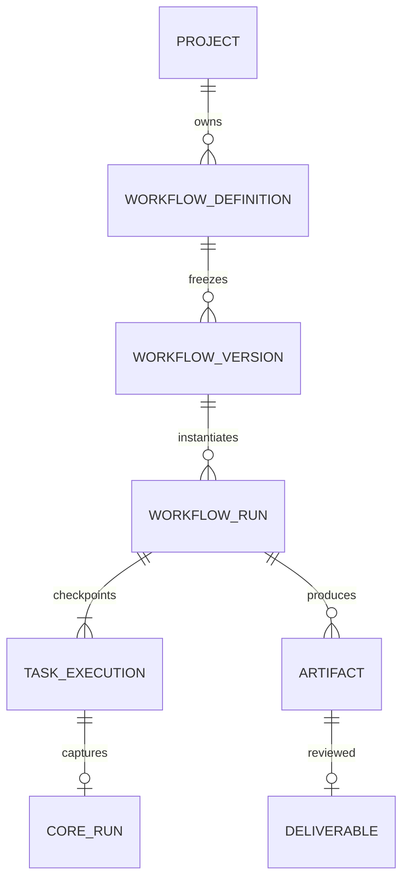
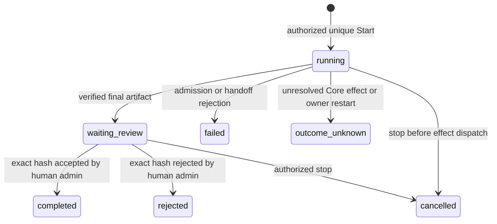

# Executable workflows and reviewed artifacts

Audit baseline: `ba2140bc396a6dbebef76d510d8288309eafa847` on development, clean and equal to origin. Dependency [ARYN Quality 37883814142](https://github.com/aryn-labs/aryn/actions/runs/37883814142) completed-success. The supplied redesign PRD v1.2 and Prompt 03 define this implementation; missing normative PDFs in the adjacent aryn-docs index are not claimed read. Current delivery results and source/CI provenance are recorded in studio-redesign-progress.md.

## Domain and storage

`WorkflowDefinition` is an explicitly saved shared draft with revision CAS. Graph and positions roundtrip through strict typed contracts. Immutable `WorkflowVersion` freezes the validated graph, signed source revision, pinned published agent versions and canonical SHA-256 digest. Position changes do not change that digest. Published graph history is never edited or backfilled. A new revision can freeze a new graph version; agent Factory publication/Bench/approval requirements continue to apply independently.



TaskExecution is a typed bounded vector inside each signed WorkflowRun checkpoint rather than a second independently scheduled row/worker. It records node, status, exact Core run, input and output artifact IDs. Checkpoint writes lock the WorkflowRun row and verify the existing protected head. Indexed status mirrors are checked against the signed payload; recovery selects active runs without loading all completed history. The runtime dispatch callback persists the task's Core run ID in the same transaction as Core claim/reservation, before inference. Trusted workflow/run/node references are part of signed Core assignment provenance and support actual Console/Operations reverse links. No database transaction spans inference.

Migration `018_workflow_execution` follows 017/016/015 and adds five empty scoped tables: workflow_definitions, workflow_versions, workflow_runs, workflow_artifacts and workflow_deliverables. Existing signed histories and run claims are untouched. Immutable tables have UPDATE/DELETE/REPLACE/TRUNCATE guards. Draft/run checkpoint deletion and replacement are forbidden; legitimate Core checkpoint updates remain possible. Metadata initialization and migration both install guards. Downgrade counts every new table before dropping any table and refuses populated records. Exporting data does not itself authorize deleting historical evidence.

Local and Hosted use the same storage contract over their existing configured SQLite/PostgreSQL databases: bounded LargeBinary blobs with signed manifest and independent protected commitment. This avoids filesystem paths, ZIP archives, object-store credentials, extra network adapters and silent transfers. Durable restart requires the existing database, signing secret and protected commitment store. In-memory SQLite is only a disposable test profile. PostgreSQL runtime must remain a separate restricted writer; migration owner/DDL credentials are never delivered to a worker.

For a provisioned runtime role, extend the existing policy after migration:

```sql
REVOKE UPDATE, DELETE, TRUNCATE, TRIGGER
ON workflow_versions, workflow_artifacts, workflow_deliverables FROM aryn_runtime;
GRANT SELECT, INSERT
ON workflow_versions, workflow_artifacts, workflow_deliverables TO aryn_runtime;
REVOKE DELETE, TRUNCATE, TRIGGER
ON workflow_definitions, workflow_runs FROM aryn_runtime;
GRANT SELECT, INSERT, UPDATE
ON workflow_definitions, workflow_runs TO aryn_runtime;
```

The existing hosted writer prerequisite now verifies these guards and grants when workflow tables exist. Operator provisioning, host ACLs, protected volumes, real IdP/TLS and hosted deployment UAT remain separate requirements.

## Graph admission and transitions

Graph limits: 24 nodes, 32 edges, 1–8 execution tasks, 24 levels, exactly one Start, Review and End. Each ordinary node has one `value` output; a Condition has exactly `yes` and `no`. One selected sequential path runs; fan-out/parallel workers are unsupported. Every graph path must reach the unique review, which directly precedes End. Server rejects duplicate IDs, absent nodes, bad ports, incompatible schemas, cycles, orphans, unreachable nodes, review bypass and excess tasks/fan-out. Drafts may preserve an invalid graph for repair, but cannot become executable versions.

Schemas are explicit bounded envelopes: text, research brief and draft content are JSON `{schema, text}` carrying actual sanitized Core output; website is an inert HTML document. They do not claim citations, research accuracy or schema fields a model did not supply. Agent tasks require a scoped active assignment whose verified publication and activation history match the pinned AgentVersion; grants must be empty. Assignment rollback or revoked publication fails the next admission rather than changing the pin. `static-document-v1` is a pinned deterministic renderer, not an arbitrary runtime or code executor. Typed conditions only use contains/equals/nonempty against current text with a 100-character literal; no eval, expression source, interpolation or external lookup exists.



Task transitions are pending → running → completed, or failed/outcome_unknown/cancelled. Review checkpoints persist waiting_review. Unselected conditional branches become skipped. Review acceptance records the unique immutable Deliverable and completes End; rejection records history and skips End. Neither decision publishes a website. Reversal requires a separate new reviewed run; no receipt is erased or silently rolled back.

Start binds idempotency key to actor/workflow/version/input fingerprint. Repeated requests return the same stored run and never dispatch tasks twice; conflicting content is rejected. Review locks the run and records a unique decision bound to exact artifact digest, reviewer, reason and timestamp. Identical replay returns the same receipt; different replay conflicts. Permission/membership/session are revalidated in transactions, after awaited runtime work and at review commit; version:approve remains the existing human admin authority.

The executor reuses RunCoordinator's process/OS lock and PostgreSQL advisory owner. Every active mutation is fenced. Recovery only touches running workflows owned by a previous authority, preserves outcome_unknown and held consumption, and never automatically retries. Durable waiting review can be decided or cancelled by a newly acquired owner. For an in-flight direct turn, Stop records outcome_unknown when cancellation cannot be confirmed; a late result cannot produce artifacts or advance the workflow. Measured Core usage may subsequently settle; workflow uncertainty is retained. Provider hard total/cost guarantees are not invented. Unknown outcomes require operator reconciliation under existing Core policy, not a workflow replay API.

## Artifact isolation and threat review

Artifacts have opaque generated IDs, organization/project, exact workflow run and node, source artifact, Core run/AgentVersion/actual model when applicable, allowlisted MIME, SHA-256 digest, size and validation method. The downstream consuming nodes are derived from verified persisted task inputs. Bounded inventory pages authenticate manifest metadata and protected heads. Detail, payload reads and downloads additionally verify byte length/digest and renderer/envelope validity. Every downstream handoff also verifies schema and originating workflow run; failure blocks the consumer. Limit is 64 KiB per artifact, with no user upload endpoint, executable MIME or arbitrary storage key.

Website render contains an allowlisted document skeleton and HTML-escaped text only. No raw model markup, resource URL, styles, script, event attribute, form, template expression, shell, host file or network transport is accepted. Reconstructed renderer bytes must match the stored staging bytes before commit and download. Preview uses iframe srcDoc with `sandbox=""`: scripts, same-origin privileges, navigation, forms and outbound capabilities are not granted. A restrictive document CSP also denies resources; API preview/download preserve the restrictive CSP header, nosniff, no-store and attachment disposition for download. Studio's normal security policy remains intact.

Isolation follows the reviewed [iframe sandbox contract](https://developer.mozilla.org/en-US/docs/Web/HTML/Reference/Elements/iframe) and [CSP sandbox directive](https://developer.mozilla.org/en-US/docs/Web/HTTP/Reference/Headers/Content-Security-Policy/sandbox). CSP sandbox is enforced by the response header/iframe attribute, not a claim that a meta tag alone supports that directive. Escaped inert text remains safe when a downloaded document is opened outside the HTTP preview. Automated injection, corrupt-renderer, browser frame and accessibility checks complement this implementation review; they are not an independent external security certification.

| Threat | Fail-closed boundary / observed test source |
|---|---|
| Cross-project version/artifact/download, viewer reviewer, revoked membership | Core scope and transaction revalidation; test_workflow_execution.py / test_workflow_persistence.py |
| Mutable graph/hash, stale approval, assignment pin change | canonical digest, signed manifest/protected heads, existing known_good/activation authority |
| Double Start/review, lost response, crash/unknown, stale worker | unique claims, row locks, Core callback, same single-owner fence; live PostgreSQL contention/recovery |
| Missing handoff, corrupt blob/MIME, SQL owner tamper | manifest signature, digest/length/envelope validation; SQL guards plus read verification even after guard bypass in disposable owner attack |
| Conditional injection, cycles, fan-out, oversize | strict allowlisted typed predicate, backend bounded graph validator and artifact cap |
| Website script/HTML/path traversal, unsafe staging renderer | text escaping, opaque sandbox, CSP, generated IDs, no uploads/paths, independent blob validation |
| Unresolved consumption, budget exhaustion, tools/native jobs | existing Core reservations/settlement, measured usage, denied grants and unchanged confined runtime; full native/Core regression gates |

## API and user surfaces

All endpoints resolve authenticated actor and project through existing Core. `/workflows` is registry/create; `/:id` reads/saves with revision; `/:id/validate` reports sanitized node/edge issue IDs; `/:id/versions` freezes/lists; `/workflow-versions/:id` reads immutable graph. `/:id/runs` creates/lists; `/workflow-runs/:id` reads timeline, `/stop` requests cancellation, `/review` commits exact hash. `/outputs` lists artifacts, `/:id` reads manifest/consumers, `/preview` returns inert content and `/download` returns attachment. `/deliverables` lists/reads immutable decisions; `/review-queue` lists actual waiting workflows.

Lists use bounded pages (default 25, maximum 100), newest timestamp plus ID. The continuation is a scoped record reference, not an authorization bearer token: server resolves/verifies it in the current scope and workflow filter on every request. Unknown/duplicate query keys and invalid bounds are rejected. Detail and preview requests carry AbortSignal and scoped React Query keys. Permission errors hide cached canvas/output; no client claim grants write authority.

React Flow provides actual graph connect/drag, typed inspector and palette. The structured editor exposes every node/schema/target/predicate/edge and input without pointer gestures. Explicit save, revision conflict and reload/restore retain local edits in memory; route/project/document guards protect unsaved input. Version freezing is separate from save. Detail shows immutable version, actual task states and exact Console/artifact links; Outputs provides review queue, sandbox preview, decisions and authorized download. No synthetic task traces, costs or success are added.

## Evidence and limits

SQLite/actual disposable PostgreSQL golden tests execute two distinct governed agent versions through Core plus the deterministic static renderer, verify all three tasks, downstream inputs, actual model/Core claims and accept/reject receipts. Additional tests cover contention, owner restart, retained reservation, corruption, role/tenant, input CAS, invalid graphs, timeout, unknown usage, budget and confinement. Browser tests use a fresh API/database/runtime per case; they cover real canvas drag, keyboard, conflict, server issues, three-task review/download, both themes/three widths, axe and bounded API/navigation benchmarks. Full suite counts and current-SHA CI are reported only after actual completion in progress.

Residual boundaries: sequential manual workflows, one terminal review, one selected branch at a time, bounded text envelopes and one inert renderer. No general DAG parallel executor, scheduler, Brief/Relay service, external connector, public website deployment or paid request was introduced. Large-scale workflow/artifact production load and independent external penetration review remain unverified; the measured fixture and API samples are explicitly limited. These boundaries preserve the requested initial executable workflow without granting host capabilities.
